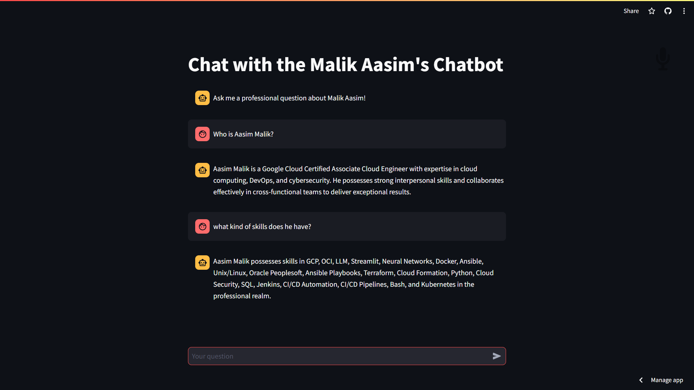

# 🦙📚 **LlamaIndex - Chat with My Custom Chatbot**

This project builds a personalized chatbot powered by LlamaIndex, a powerful tool for indexing and retrieving information. It leverages the capabilities of GPT-3.5 and augments it with my professional data, allowing you to have informative conversations about my work experience.



## Key Features

- **Targeted Responses:** Ask questions related to my professional background, and the chatbot will use your indexed data to provide insightful answers.
- **Streamlit Integration:** The user interface is built with Streamlit, offering a user-friendly chat experience.

## How it Works

1. **User Input:** Interact with the chatbot by typing your questions directly into the chat interface.
2. **Data Retrieval:** LlamaIndex seamlessly retrieves relevant information from your indexed professional data.
3. **GPT-3.5 Augmentation:** Leveraging the power of GPT-3.5, the chatbot generates comprehensive and informative responses.

## Getting Started

### Prerequisites

- An OpenAI API key (instructions below)
- Python 3.x

### Installation

1. Clone the repository:
   ```bash
   git clone https://github.com/AasimMalik20/MyChatBot.git
   ```

2. Install dependencies:
   ```bash
   pip install -r requirements.txt
   ```

3. Obtain an OpenAI API Key:
   - Visit [OpenAI API Key Guide](https://help.openai.com/en/articles/4936850-where-do-i-find-my-openai-api-key) and create a new secret key.
   - Store the key securely in the Streamlit workspace (not in the repository).

4. Create a Streamlit account:
   - [Streamlit](https://share.streamlit.io/)
   - Create a new app and enter the respective details [GitHub link and secret key].

### Running the App

You can also run the app from the terminal:
```bash
python streamlit run streamlit_app.py
```

This will launch the Streamlit app in your web browser.

### Usage

Once the app is running, simply type your questions about your professional background in the chat window and hit enter. The chatbot will analyze your query and respond using your indexed data.

---

*Source Data*: This project is inspired by a great blog post on building a chatbot with Streamlit and LlamaIndex: https://blog.streamlit.io/build-a-chatbot-with-custom-data-sources-powered-by-llamaindex/
